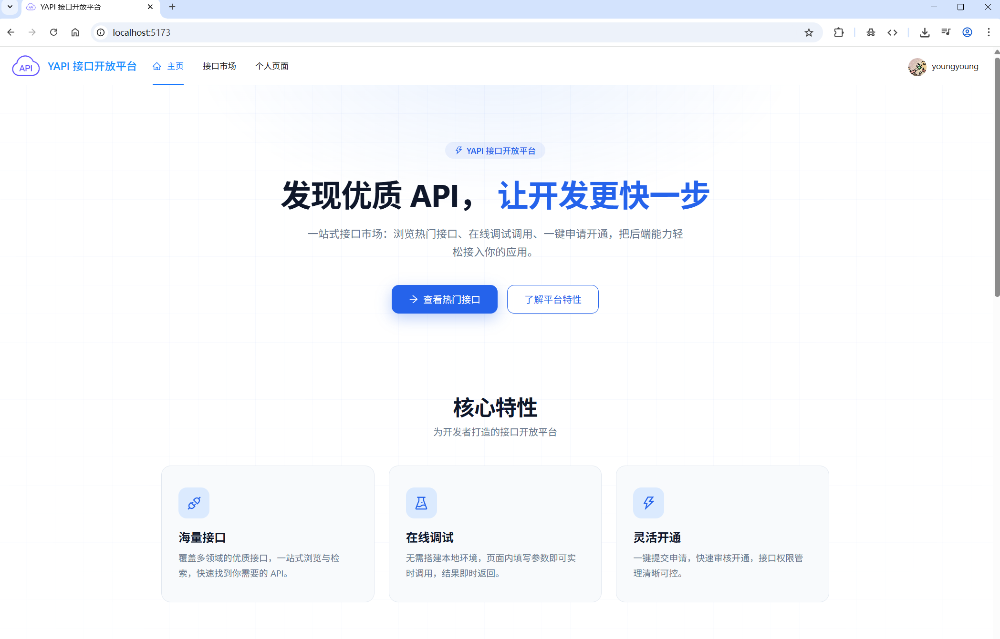
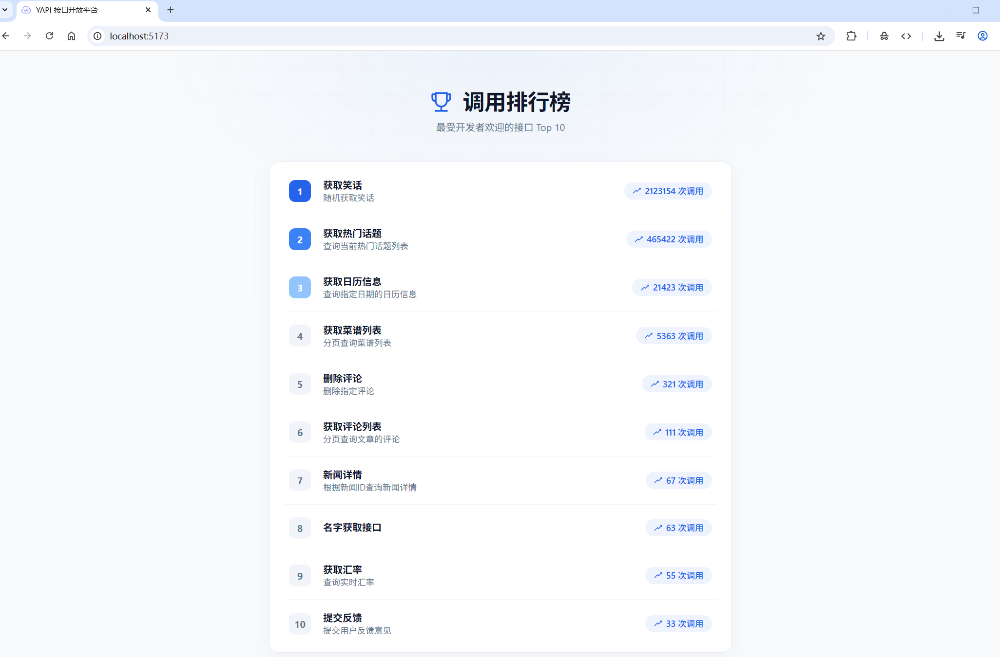
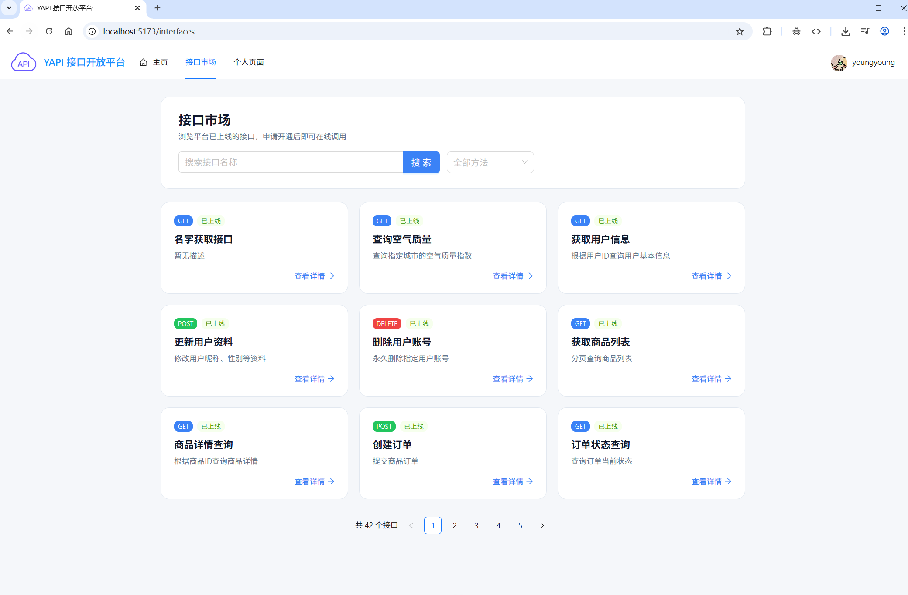
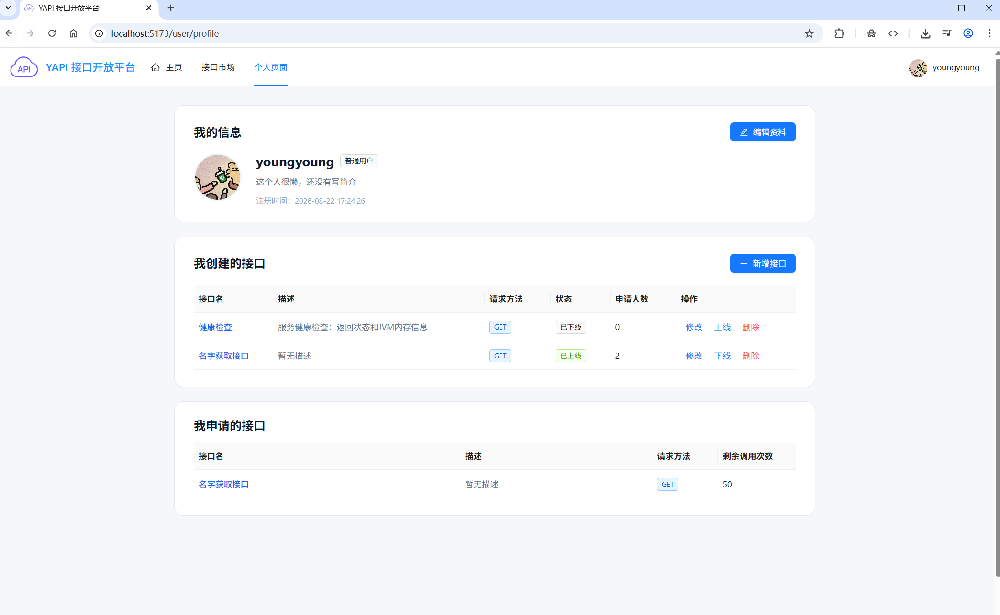

# yApiRelay — 接口开放平台

yApiRelay（接口开放平台）是 API 开放平台 / 接口市场项目：连接接口提供方与调用方，提供方在平台发布接口，调用方按需申请调用，平台负责鉴权、转发与计次统计。

平台提供两种调用接口的方式：

- **SDK 调用（面向第三方开发者）**：引入平台提供的 Java SDK，请求经平台网关转发；第三方无需接触接口真实地址，只需使用平台签发的 accessKey/secretKey 与接口路径即可调用，接口地址不暴露、调用可鉴权；
- **在线调用测试（面向平台用户）**：在平台前端浏览接口市场、查看接口详情，使用「在线调用」功能直接测试接口，了解接口功能与请求参数。

平台对每次调用的安全保障：accessKey/secretKey 签名认证、nonce/timestamp 防重放；附加能力：调用次数统计与调用排行榜。

## 功能特性

- 用户注册登录，签发 accessKey / secretKey 密钥对用于签名认证
- 接口信息管理：创建、修改、删除、发布、下线，全流程状态流转
- 在线调用：申请开通后即可调用接口，支持 GET / POST 等请求方式
- 调用次数统计：每次调用自动扣减次数
- 网关统一鉴权：校验签名、防重放，转发到对应后端服务
- 提供 Java 客户端 SDK，开发者引入依赖即可用几行代码接入平台接口
- 内置 Knife4j 接口文档，前后端通过 OpenAPI 规范自动生成 API 代码

## 界面展示

<table>
  <tr>
    <td align="center"><br /><i>首页</i></td>
    <td align="center"><br /><i>排行榜</i></td>
  </tr>
</table>



<i>接口市场</i>



<i>个人页面</i>

## 技术栈

- 后端：Java 8、Spring Boot、Spring Cloud Gateway、Spring Cloud Alibaba Nacos、Dubbo、MyBatis-Plus、MySQL、Redis、RabbitMQ、Spring ThreadPoolTaskExecutor
- 前端：Vue 3、TypeScript、Vite、Ant Design Vue、Pinia、Vue Router
- SDK：Java、Hutool、Lombok

## 项目结构

```text
y-api-microservice/   后端微服务（用户、接口、关系、网关、公共模块）
yapi-client-sdk/      Java 客户端 SDK
yapi-fronted/         前端项目（Vue 3 + TypeScript）
yapi-interface/       模拟接口提供方，提供示例接口供测试调用
```

## y-api-microservice —— 后端微服务

基于 Spring Cloud Alibaba 的后端微服务集群，包含 y-api-user（用户服务）、y-api-interface（接口服务）、y-api-userinterface（用户接口关系与排行榜）、y-api-gateway（网关）、y-api-common（公共模块）等模块。服务间通过 Dubbo 进行 RPC 调用，Nacos 负责服务注册发现与配置管理。

后端核心功能：

- 用户管理：注册、登录、个人中心、管理员用户增删改查，accessKey / secretKey 签发
- 接口管理：接口信息增删改查、发布 / 上线、下线 / 下架
- 在线调用：申请开通后校验签名并转发调用，扣减剩余调用次数
- 调用统计：调用次数累计、剩余次数、调用排行榜
- 统一网关：请求签名鉴权（accessKey、nonce、timestamp、sign）、路由转发、跨域处理

详细文档：[y-api-microservice README](./y-api-microservice/README.md)

## yapi-client-sdk —— Java 客户端 SDK

SDK 的设计目的是让开发者无需关心签名算法与请求细节，只需传入平台签发的 accessKey / secretKey 和接口信息，即可轻松调用平台上发布的接口。SDK 会自动构造签名请求头（accessKey、nonce、timestamp、body、sign，SHA256 签名）并发起请求。

### 快速开始

1. 本地安装 SDK 到 Maven 仓库

在 `yapi-client-sdk` 目录下执行：

```bash
mvn install
```

2. 在项目 `pom.xml` 中引入依赖

```xml
<dependency>
    <groupId>cn.y.yapi-client-sdk</groupId>
    <artifactId>yapi-client-sdk</artifactId>
    <version>0.0.1-SNAPSHOT</version>
</dependency>
```

3. 注册平台账号获取密钥

在平台注册并登录后，从个人中心获取自己的 accessKey 和 secretKey；同时需要在接口市场申请开通目标接口。

4. 编写代码调用接口

```java
import cn.y.yapiclientsdk.client.YApiClient;
import cn.y.yapiclientsdk.model.InterfaceInfo;

public class YApiDemo {

    public static void main(String[] args) {
        // 1. 使用平台签发的 accessKey / secretKey 创建客户端
        YApiClient client = new YApiClient("你的 accessKey", "你的 secretKey");

        // 2. 构造要调用的接口信息
        InterfaceInfo interfaceInfo = new InterfaceInfo();
        interfaceInfo.setUrl("/api/name");                   // 平台接口的调用路径
        interfaceInfo.setMethod("GET");                      // 请求方法：GET / POST 等
        interfaceInfo.setRequestParams("name=yapi");         // 请求参数：GET 拼接在 URL 后，其他方法放入请求体
        interfaceInfo.setRequestHeader("{\"Content-Type\":\"application/json\"}");

        // 3. 发起调用并打印响应结果
        String result = client.invokeInterface(interfaceInfo);
        System.out.println(result);
    }
}
```

说明：SDK 当前内置网关地址为 `http://localhost:18098`，本地联调可直接使用；部署到其他环境时请修改 `YApiClient` 中的 `GATEWAY_HOST` 常量或将其改为可配置项。

### 核心类与方法

| 类 / 方法 | 说明 |
| --- | --- |
| `YApiClient(String accessKey, String secretKey)` | 构造客户端，传入平台签发的密钥对 |
| `String invokeInterface(InterfaceInfo interfaceInfo)` | 发起接口调用：自动拼接网关地址、构造签名请求头，返回响应字符串 |
| `InterfaceInfo` | 调用参数模型，字段：`url`（接口路径）、`method`（请求方法）、`requestParams`（请求参数）、`requestHeader`（请求头 JSON）、`responseHeader` |
| `SignUtils.genSign(String content, String secretKey)` | 签名工具，对 `content + "." + secretKey` 做 SHA256 摘要并返回十六进制签名 |

详细文档：[yapi-client-sdk README](./yapi-client-sdk/README.md)

## yapi-fronted —— 前端项目

基于 Vue 3 + TypeScript + Vite 的前端项目，UI 使用 Ant Design Vue，状态管理使用 Pinia。包含首页落地页、接口市场、接口详情（在线调试调用）、登录注册、个人中心、后台管理等页面，采用天蓝 + 纯白 SaaS 风格。后端接口代码由 openapi2ts 根据 OpenAPI 文档自动生成在 `src/api` 目录。

详细文档：[yapi-fronted README](./yapi-fronted/README.md)

## yapi-interface —— 模拟接口提供方

独立的 Spring Boot 应用，扮演平台"上游接口提供方"角色，提供若干示例接口（如根据名称返回问候信息的 NameController）供开发者测试 SDK 调用和平台联调。网关收到合法调用请求后，最终转发到该服务执行。

详细文档：[yapi-interface README](./yapi-interface/README.md)
